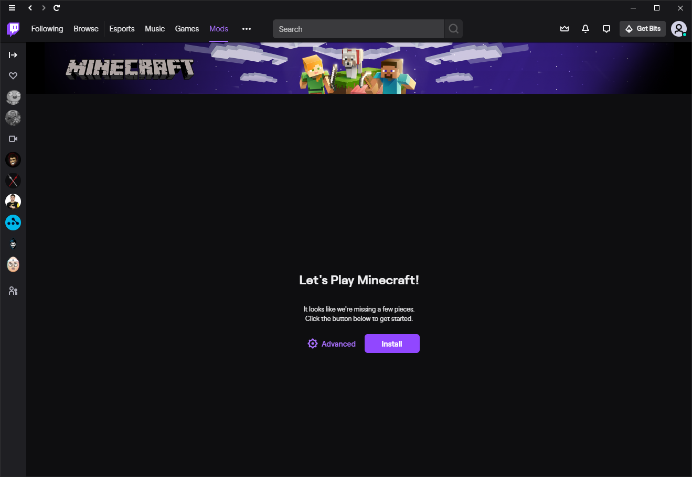
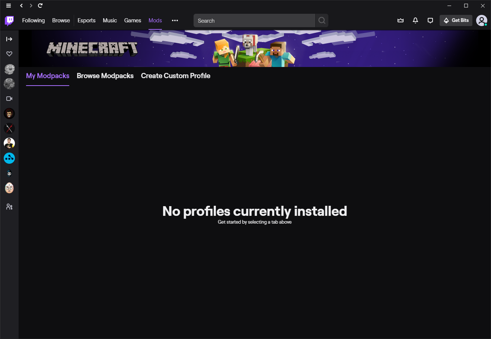
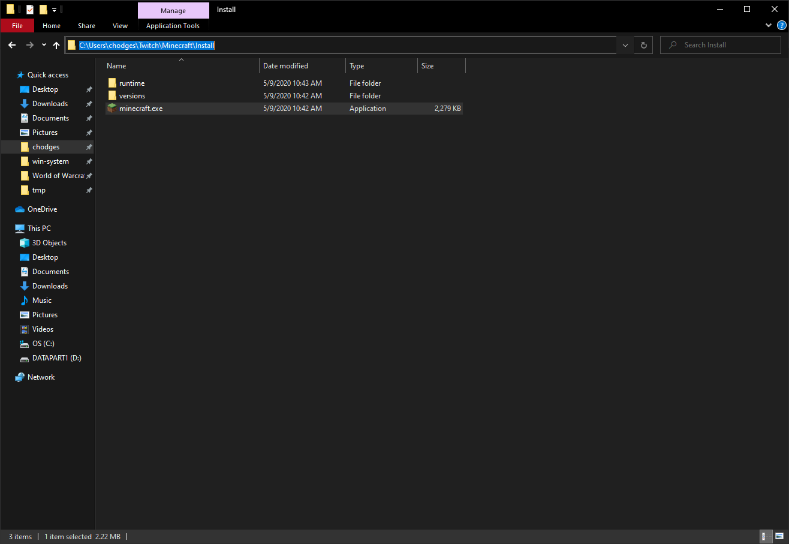
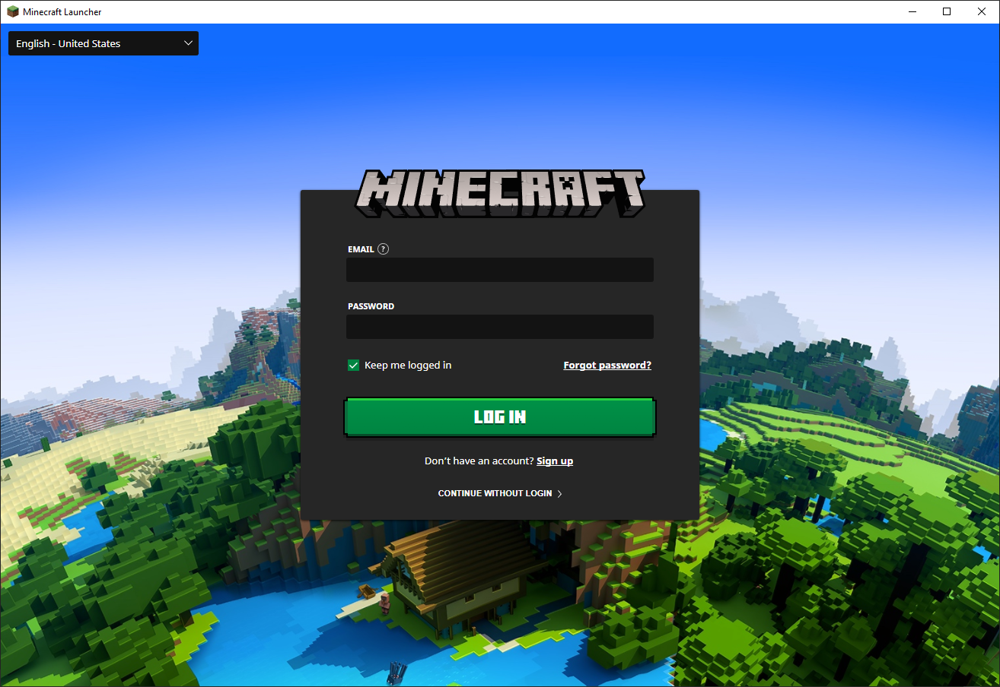
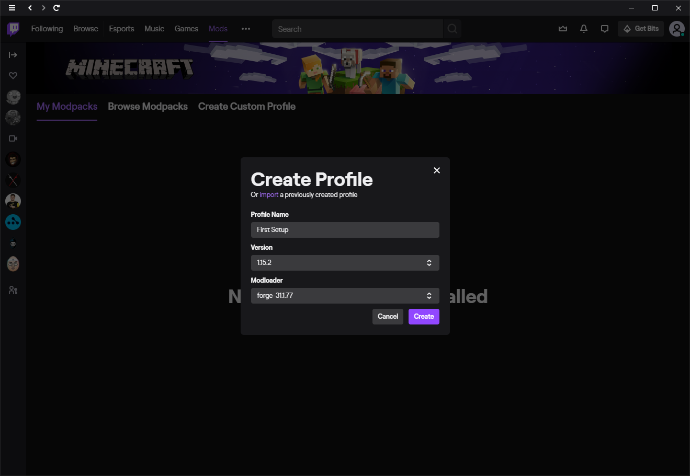
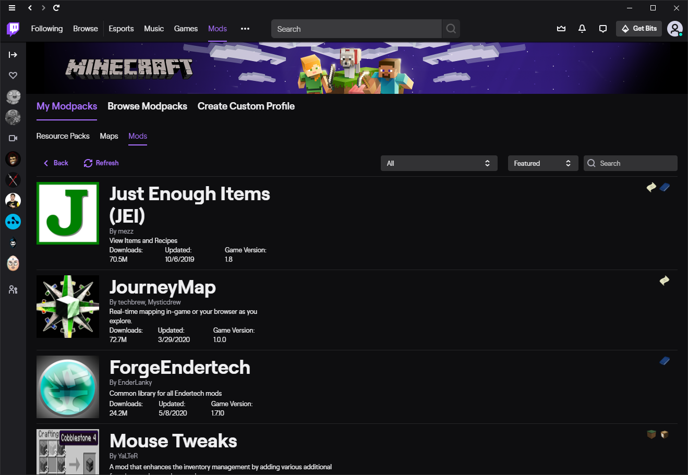
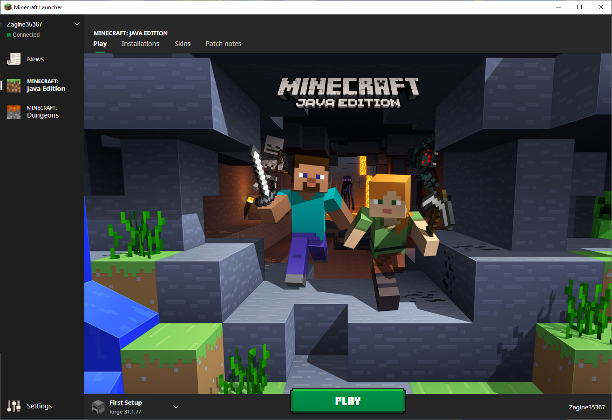
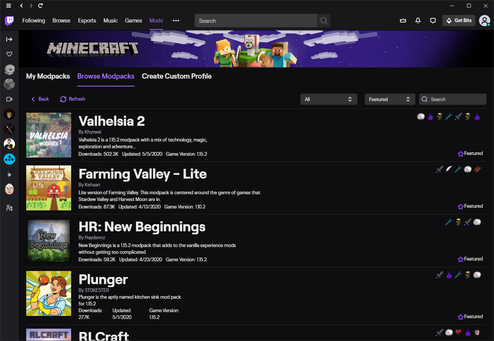
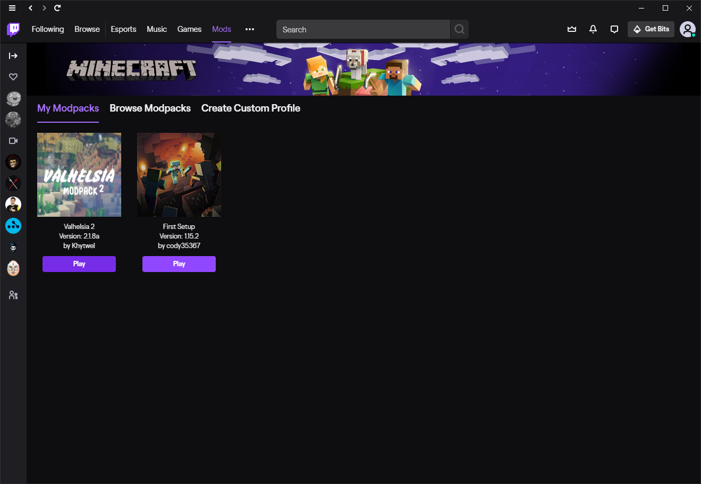

# Using the Twitch app

## Prerequisites
- The Twitch app is installed and the user is logged into this app (I did not verify if the login is required). Can be downloaded [here](https://desktop.twitchsvc.net/installer/windows/TwitchSetup.exe) if needed.
- A purchase of Minecraft and a valid Mojang/Minecraft login.

Note: An existing installation of Minecraft (Jave Edition) will not be used in this setup and is not required. The Twitch app will download, install, and manage the customm Minecraft installation going forward. Most global configurations and saves can be found in the default minecraft home directory location (a.k.a. `%appdata%\.minecraft` on Windows).

## Setup
1. Open the Twitch app, select Mods -> Minecraft.

2. Select 'Install' and wait for the process to finish. You should see the below once it is complete.

3. Open a Windows File Explorer window, navigate to `%userprofile%\Twitch\Minecraft\Install`, and run `minecraft.exe`. Below is an example path.

4. Wait for the Minecraft Updater to finish and present you with the below login screen. Login (if not alreaady) and then close the Laucher for now.

5. Go back to the Twitch app, select create profile, and fill out the below form and selct 'Create'.
- Note: 
  - Profile name can be whatever you want
  - Version can be the whatever you want and usally the latest is okay
  - Do not modify the Modloader, this will change with the Minecraft version as required.

6. Once the profile finishes being setup, select the profile under My Modpacks -> Get More Content (top-right). This should take you to the below page. Here is where you can install Resource Packs, Maps, and Mods for this current profile. Note: Do not worry about the Game Version on each item, this usually is just the minimum version required and most newer versions should work.

7. Once complete, selct the '< back' button (top-left) until you get back to the main 'My Modpacks' page and then select 'Play' to start the Minecraft Launcher. You will see in the below that forge is pre-selected, just press play from here to play the game.

## Complete Modpacks
1. If you go under 'Browse Modpacks' in the Twitch app you can download complete packs of mods that are put together for you to consume as one complete experience. These do not require a specific profile as we setup in the previous section, but are their own profiles and will be configured and played individually.

2. Select install on the modpack and then go to 'My Modpacks' profile page to play these after the installation is complete. 

